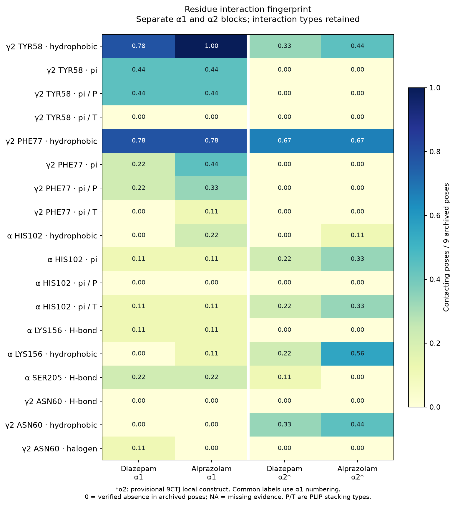
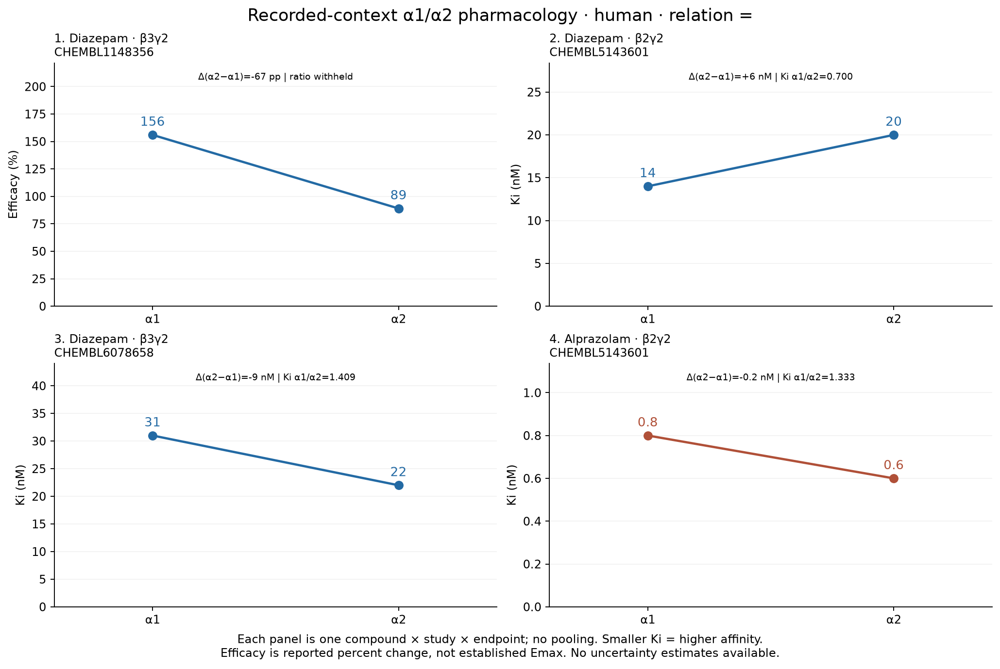
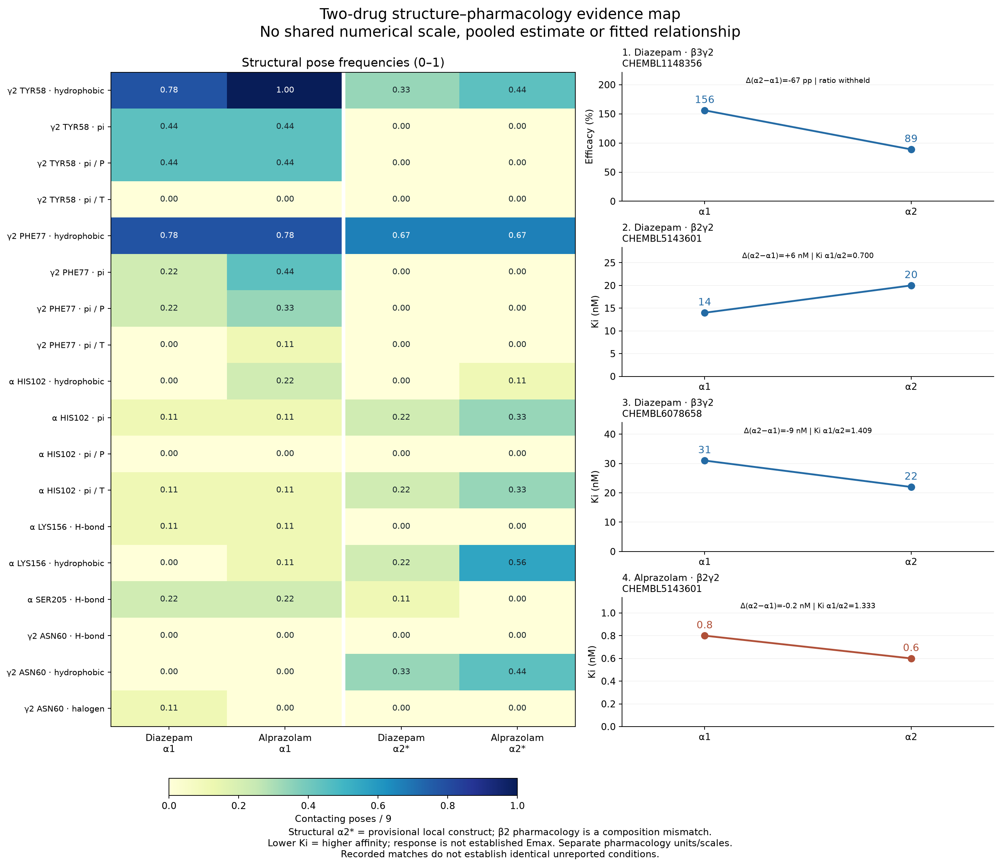
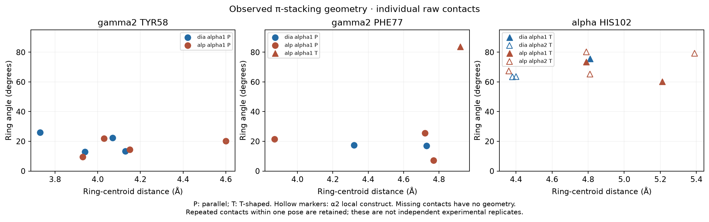

# Diazepam / alprazolam integration — 20260918_2126_diazepam_alprazolam_integration

## 目的と結論

既存IFPとrecorded-context α1/α2薬理pairを並べた記述的PoC。新しいDocking、ML、相関検定、phenotype予測は実施していない。
**残基別・interaction type別の構造差は存在するが、薬理差を一貫して説明することは未検証。単純な「contactが多い側ほどKiが低い」という一変数の説明は、このデータ全体には合わない。**

## 1. Matched pharmacologyをpairごとに表示

すべてhuman、relation `=`。Δはα2−α1、ratioはKi(α1)/Ki(α2)。元の数値文字列・ID・文献・組成・単位・relationを保持。study間の平均は計算しない。
Kiは小さいほど報告されたbinding affinityが高い。ratio > 1はこのpairでα2のKiが低いことを示すが、selectivityカテゴリは付けない。

| drug / document | endpoint・背景 | α1 value | α2 value | Δ α2−α1 | Ki α1/α2 | α1 activity / assay | α2 activity / assay |
|---|---|---:|---:|---:|---:|---|---|
| diazepam / CHEMBL1148356 | Efficacy % / β3γ2 | 156.0 | 89.0 | -67.0 | NA（未計算） | 667545 / CHEMBL677030 | 667547 / CHEMBL680445 |
| diazepam / CHEMBL5143601 | Ki nM / β2γ2 | 14.0 | 20.0 | 6.0 | 0.7 | 24843214 / CHEMBL5146040 | 24843235 / CHEMBL5146041 |
| diazepam / CHEMBL6078658 | Ki nM / β3γ2 | 31.0 | 22.0 | -9.0 | 1.40909 | 29082441 / CHEMBL6080337 | 29082452 / CHEMBL6080338 |
| alprazolam / CHEMBL5143601 | Ki nM / β2γ2 | 0.8 | 0.6 | -0.2 | 1.33333 | 24843226 / CHEMBL5146040 | 24843247 / CHEMBL5146041 |

Efficacyの156%対89%は、記録された電気生理応答のpercent changeであり差は−67 percentage points。濃度・GABA条件・正規化基準の詳細が不十分なので、Emaxとは呼ばずratioも計算しない。
各pairは前runの候補認定をそのまま使用。原著Methods/表を本runで再監査したものではなく、未記載条件・実験誤差・反復数の一致は未確認。数値差がゼロでないことと、実験的に有意な差があることを区別する。

薬理文献（取得済みChEMBL document metadataから）：
- CHEMBL1148356: [Synthesis and biological evaluation of 3-heterocyclyl-7,8,9,10-tetrahydro-(7,10-ethano)-1,2,4-triazolo[3,4-a]phthalazines and analogues as subtype-selective inverse agonists for the GABA(A)alpha5 benzodiazepine binding site.](https://doi.org/10.1021/jm0407613)。PMID 15214791。
- CHEMBL5143601: [Rationalizing the binding and α subtype selectivity of synthesized imidazodiazepines and benzodiazepines at GABAA receptors by using molecular docking studies.](https://doi.org/10.1016/j.bmcl.2022.128637)。PMID 35218882。
- CHEMBL6078658: [Use of imidazo[1,5-a]quinoline scaffold as the pharmacophore in the design of bivalent ligands of central benzodiazepine receptors.](https://doi.org/10.1016/j.bmc.2024.118006)。PMID 39577296。

## 2. 構造IFPと残基対応

使用するのは `20260917_1706_structure_mouse_bridge` のreceptor-specific再対応済みIFP。以前のchain-D共有keyによる割当を再利用せず、元PLIP行と修正mappingを照合した。
α1は6HUPのfull pentamer（human α1β3γ2L）。α2は9CTJのC/D/E鎖（β3/α2/γ2）だけの局所construct。
9CTJ全体はβ2–α1–β3–α2–γ2のmixed native assemblyで、純粋なα2β3γ2 full pentamerではない。両側は厳密なmatched構造対ではない。
β2薬理（両剤）とβ3構造の不一致、γ2 splice formの詳細不一致/未記載、6HUPのdiazepam-bound templateと9CTJ由来構造の状態差・box移送も交絡する。
humanという種名が一致するだけでは実験条件やconstructの一致にはならない。

| 共通ラベル | α1 実残基 | α2 実残基 |
|---|---|---|
| γ2 TYR58 | C:TYR58 | E:TYR58 |
| γ2 PHE77 | C:PHE77 | E:PHE77 |
| α HIS102 | D:HIS102 | D:HIS101 |
| α LYS156 | D:LYS156 | D:LYS155 |
| α SER205 | D:SER205 | D:SER204 |
| γ2 ASN60 | C:ASN60 | E:ASN60 |

36 archived poses（2剤×2系×9）を使用。頻度はunique interacting pose数 / 9。poseは同一seedの候補配座であり、9回の独立実験・平衡占有率・結合自由エネルギーではない。
既存feature表に行がない要求featureも、mapping、prepared receptorの残基存在、全poseのcontact archiveを検証できた場合に限り「0 contacts」を計数。欠損値の0置換ではない。証拠不足ならNA。
geometryは観測contact行のみの条件付き記述。π接触のないα2 TYR58/PHE77のcentdist/angle/offsetはNAのまま。

| drug | site / interaction | α1 count/9 | α2 count/9 | Δ frequency α2−α1 |
|---|---|---:|---:|---:|
| diazepam | gamma2_TYR58 / hydrophobic | 7/9 | 3/9 | -0.444 |
| diazepam | gamma2_TYR58 / pi | 4/9 | 0/9 | -0.444 |
| diazepam | gamma2_PHE77 / hydrophobic | 7/9 | 6/9 | -0.111 |
| diazepam | gamma2_PHE77 / pi | 2/9 | 0/9 | -0.222 |
| diazepam | alpha_HIS102 / hydrophobic | 0/9 | 0/9 | +0.000 |
| diazepam | alpha_HIS102 / pi | 1/9 | 2/9 | +0.111 |
| diazepam | alpha_LYS156 / H-bond | 1/9 | 0/9 | -0.111 |
| diazepam | alpha_LYS156 / hydrophobic | 0/9 | 2/9 | +0.222 |
| diazepam | alpha_SER205 / H-bond | 2/9 | 1/9 | -0.111 |
| diazepam | gamma2_ASN60 / H-bond | 0/9 | 0/9 | +0.000 |
| diazepam | gamma2_ASN60 / hydrophobic | 0/9 | 3/9 | +0.333 |
| diazepam | gamma2_ASN60 / halogen | 1/9 | 0/9 | -0.111 |
| alprazolam | gamma2_TYR58 / hydrophobic | 9/9 | 4/9 | -0.556 |
| alprazolam | gamma2_TYR58 / pi | 4/9 | 0/9 | -0.444 |
| alprazolam | gamma2_PHE77 / hydrophobic | 7/9 | 6/9 | -0.111 |
| alprazolam | gamma2_PHE77 / pi | 4/9 | 0/9 | -0.444 |
| alprazolam | alpha_HIS102 / hydrophobic | 2/9 | 1/9 | -0.111 |
| alprazolam | alpha_HIS102 / pi | 1/9 | 3/9 | +0.222 |
| alprazolam | alpha_LYS156 / H-bond | 1/9 | 0/9 | -0.111 |
| alprazolam | alpha_LYS156 / hydrophobic | 1/9 | 5/9 | +0.444 |
| alprazolam | alpha_SER205 / H-bond | 2/9 | 0/9 | -0.222 |
| alprazolam | gamma2_ASN60 / H-bond | 0/9 | 0/9 | +0.000 |
| alprazolam | gamma2_ASN60 / hydrophobic | 0/9 | 4/9 | +0.444 |
| alprazolam | gamma2_ASN60 / halogen | 0/9 | 0/9 | +0.000 |

### π-stacking geometry / P・T型

[PLIPの定義](https://github.com/pharmai/plip/blob/master/DOCUMENTATION.md)でPはparallel、TはT-shaped。P/T frequencyもunique pose数 / 9。1 poseに複数contactがある場合、contact数とpose数は一致しない。
centdist・offsetはÅ、angleはdegree。以下のmeanはraw contact行の記述統計で、精度や好ましさのscoreではない。P/T混合のangle平均だけで構造を代表させず、raw contactと型を併記する。

| drug | block | site | raw contacts / poses | P / T frequency | centdist mean Å | angle mean ° | offset mean Å |
|---|---|---|---:|---|---:|---:|---:|
| diazepam | alpha1 | gamma2_TYR58 | 4 / 4 | 0.444 / 0.000 | 3.968 | 18.688 | 1.538 |
| diazepam | alpha1 | gamma2_PHE77 | 2 / 2 | 0.222 / 0.000 | 4.525 | 17.185 | 1.400 |
| diazepam | alpha1 | alpha_HIS102 | 1 / 1 | 0.000 / 0.111 | 4.810 | 75.690 | 1.340 |
| alprazolam | alpha1 | gamma2_TYR58 | 4 / 4 | 0.444 / 0.000 | 4.178 | 16.523 | 1.532 |
| alprazolam | alpha1 | gamma2_PHE77 | 4 / 4 | 0.333 / 0.111 | 4.570 | 34.455 | 1.365 |
| alprazolam | alpha1 | alpha_HIS102 | 2 / 1 | 0.000 / 0.111 | 5.000 | 66.820 | 1.440 |
| diazepam | alpha2 | gamma2_TYR58 | 0 / 0 | 0.000 / 0.000 | NA | NA | NA |
| diazepam | alpha2 | gamma2_PHE77 | 0 / 0 | 0.000 / 0.000 | NA | NA | NA |
| diazepam | alpha2 | alpha_HIS102 | 2 / 2 | 0.000 / 0.222 | 4.390 | 63.530 | 1.110 |
| alprazolam | alpha2 | gamma2_TYR58 | 0 / 0 | 0.000 / 0.000 | NA | NA | NA |
| alprazolam | alpha2 | gamma2_PHE77 | 0 / 0 | 0.000 / 0.000 | NA | NA | NA |
| alprazolam | alpha2 | alpha_HIS102 | 4 / 3 | 0.000 / 0.333 | 4.838 | 73.055 | 1.470 |

## 3. Integrated comparison

`integrated_structure_pharmacology.csv` は8 activity行。各行に元薬理fieldをすべて残し、対応するdrug×subtypeの6残基featureを横に付与する。
`structure_pharmacology_differences.csv` は各pair×12featureの48行。薬理Δと構造Δを並べるための表で、構造featureをstudyごとに独立な観測として数えない。
diazepamの同一IFPは3つの薬理pairに再利用される。この重複を標本数とする相関・回帰・有意差検定は行わない。

### Supported observation

- diazepamのKiはβ2 studyで14→20 nM（α2側が高い）、β3 studyで31→22 nM（α2側が低い）。study・背景によって方向が逆で、単一のsubtype affinity差へ統合できない。
- alprazolamのβ2 Kiは0.8→0.6 nM。記録された数値差は−0.2 nM。誤差情報がないため統計的/生物学的有意性は判断不能。
- 両剤でγ2 TYR58 πは4/9→0/9、PHE77 πはdiazepam 2/9→0/9、alprazolam 4/9→0/9。HIS102 πは1/9→2/9と1/9→3/9。
- LYS156 hydrophobicはdiazepam 0/9→2/9、alprazolam 1/9→5/9。SER205 H-bondは2/9→1/9と2/9→0/9。ASN60はH-bond、hydrophobic、halogenを別々に保持。
- α1 TYR58 π frequencyは両剤4/9で同じだがcentdist meanは3.9675と4.1775 Å。PHE77のhydrophobicは両剤7/9で同じだがπ頻度とP/T内訳は異なる。frequencyを1種類へ縮約すると情報が失われる。

### Suggestive pattern

- α1側のTYR58/PHE77 π接触の多さは、diazepam β2 pairの低いα1 Kiや大きいα1応答と定性的には並ぶ。しかし同じ構造パターンはdiazepam β3 Kiとalprazolam β2 Kiの方向には合わない。説明に都合のよいpairだけを選べない。
- α2側のHIS102 πとLYS156 hydrophobicの増加は、diazepam β3およびalprazolam β2の低いα2 Kiと並ぶ可能性がある。しかしdiazepam β2では逆向きであり、異なる残基を事後的に選ぶことによる説明は未検証。
- これらはmechanism候補の記述に留まる。全featureを保存する設計の情報保持には根拠があるが、geometryを足せば薬理の説明/予測が改善するという実証はない。

### Not supported

- 特定残基が薬理差を引き起こすこと、contact frequencyからaffinity・selectivityを予測できること。
- study差をβ2/β3そのものの効果と断定すること（tracer、cell、構造、測定条件も異なる）。
- 2剤だけから一般化すること、poseを独立標本として有意差・信頼区間を作ること。
- IFPからphenotype・鎮静・副作用を説明すること、Kiとfunctional responseを同じラベルへ統合すること。

## 4. 今回の6つの判断

1. **薬理の数値差は支持**。4 pairすべてに非ゼロ差。ただし有意性・再現性・生物学的重要性は判断不能。diazepam Kiの方向はstudy依存。
2. **定性的に並ぶfeatureはあるが、全pairに一貫した対応は支持されない**。TYR58/PHE77とHIS102/LYS156で逆向きの候補を作れてしまい、独立検証なしには説明力を選べない。
3. **frequencyだけで十分とは支持できない**。同じfrequencyでもgeometry/P・Tが異なる事実がある。frequency-onlyモデルの性能を評価したわけではない。
4. **geometryとinteraction typeを保持することは情報損失回避の点で支持**。薬理説明への増分寄与は判断不能。geometryがないcontactはNAを保つ。
5. **検証目的の限定的拡張は条件付きで合理的**。原データを保持した設計で反証テストを増やせる。一方、予測力や創薬上の価値は現在の2剤から判断不能。追加薬の大量Dockingよりmatched構造と薬理条件の確保を優先する。
6. **最優先の反証可能な仮説 H1**：両剤で観測したγ2 TYR58 πの「α1 > α2」が局所construct/単一seedだけの産物ではなく、揃えたhuman α1β3γ2 / α2β3γ2 full-pentamer条件でも再現する。
   次段階では同一調製・box規則・pose採択規則・事前指定した独立5 seedsで比較し、各剤でΔ(α2−α1)<0が4/5 seeds以上かつseed中央値<0を暫定的な再現基準として事前登録する。満たさなければこのfeatureの頑健性仮説を支持せず、construct/pose依存性を再検討する。これは生物学的因果の検定ではなく構造特徴の再現性の検証であり、今回追加計算は実施していない。
   H1が再現した場合も、同一study/β背景で両剤のKiと誤差を取得して薬理対応を別に検証する。「γ2接触が多いほど常にKiが低い」は本PoC全体では支持されないため、予測ルールとして採用しない。

## 5. 図

各図はPNG/PDFを保存。薬理とfrequencyは別axis・別unit。欠損geometryはplotしない。薬理に根拠のないerror barを付けない。

## 6. QC・provenance

QC **PASS**、19項目PASS。tests: `{"errors":0,"failures":0,"skipped":0,"source_sha256":"c793e2724275193b375ce39c3d1e22e090e376a9b72780e1432cd0124c521f18","status":"PASSED","tests":98}`。
4 pair / 8 activity / 48 IFP feature / 24 subtype feature差。元activityを平均・削除・単位変換していない。
入力のSHA-256、元activity JSONL、PLIP raw属性、mapping、pose表、PDB/prepared receptor、解析コード・config・testsのsnapshotを保存。
IFPの既存featureのfrequencyおよびcontact/pose数を再計数で照合。全poseのcontact archiveの存在、PDB/prepared receptorの残基存在を検証するが、PLIP再実行による再検出は本runでは行っていない。
コードとmanifestは実行前Git HEADに加えてsnapshot hashで識別。`LATEST_RUN.txt`と既存tracked filesの実行前後hashは不変。
再実行: `MPLBACKEND=Agg .venv/bin/python -m pytest -q --junitxml=/tmp/integration-tests.xml`、続いて
` .venv/bin/python -m src.diazepam_alprazolam_integration --test-results /tmp/integration-tests.xml`。毎回新runとなる。

構造注釈は同梱PDB header・既存調製コードと[RCSB 6HUP](https://www.rcsb.org/structure/6HUP)、[RCSB 9CTJ](https://www.rcsb.org/structure/9CTJ)（2026-09-18閲覧）を照合。原著薬理Methodsの追加確認は未完了として扱う。
