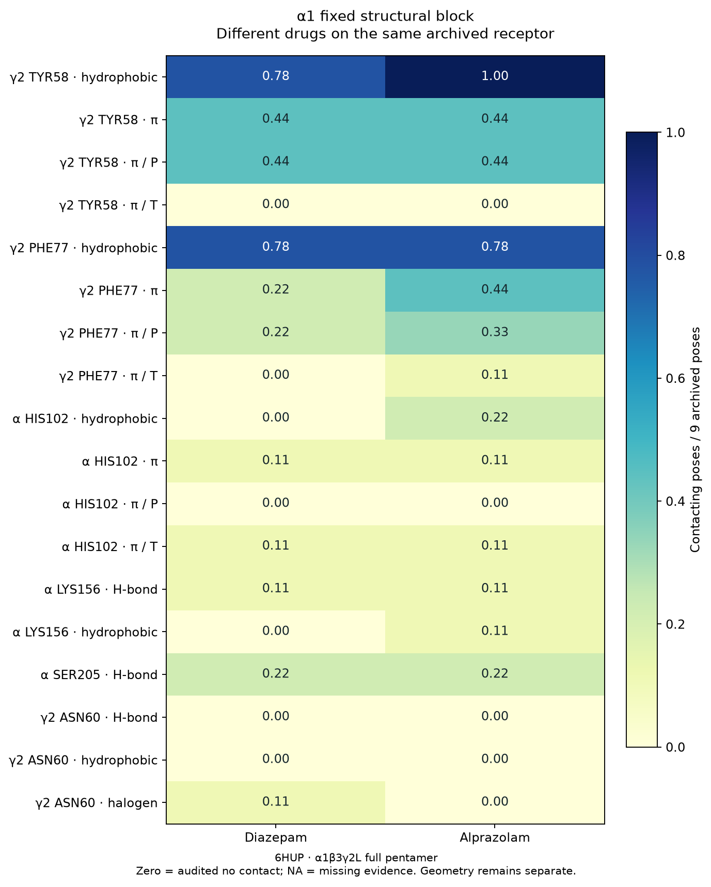
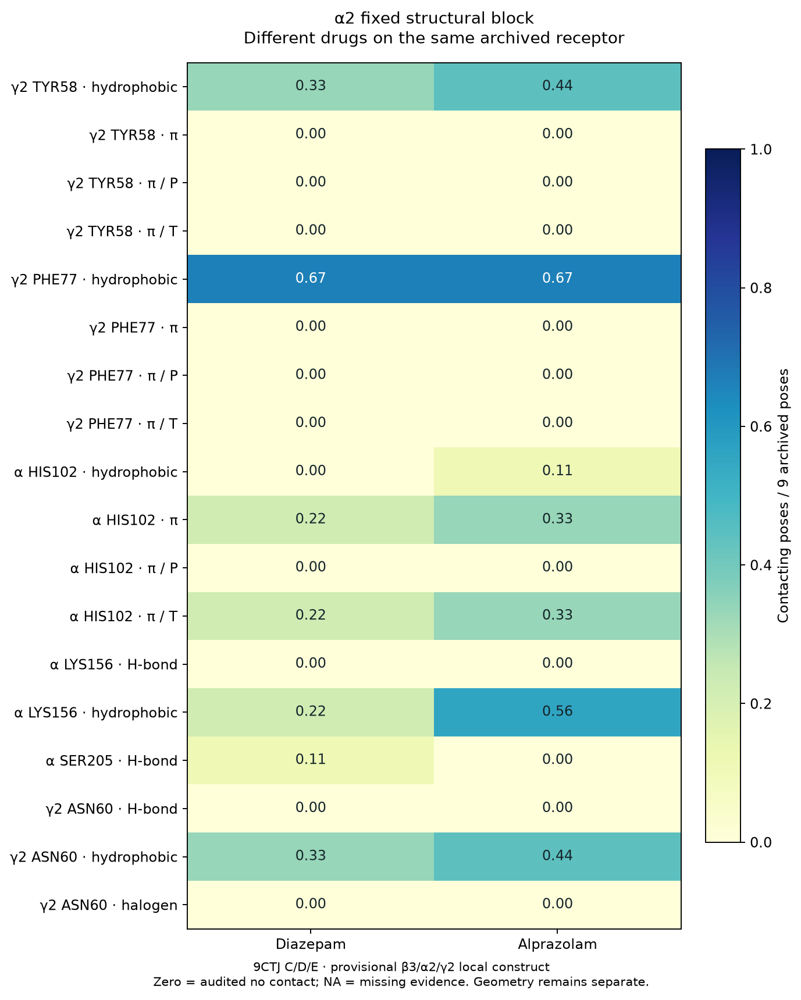
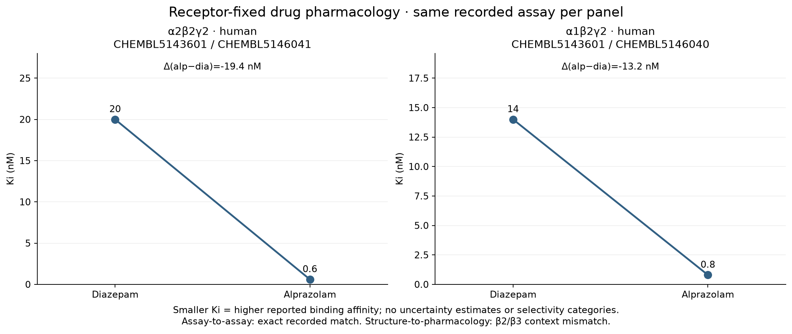
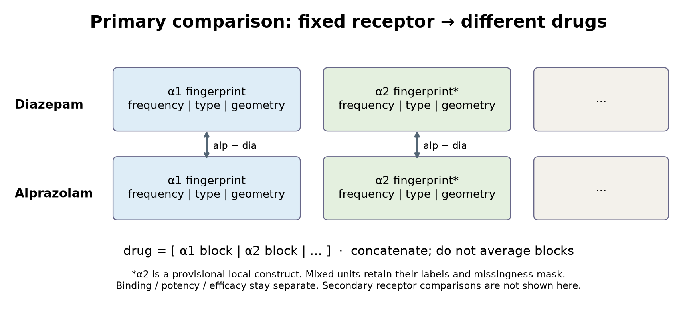

# Receptor-fixed drug comparison

主解析契約: [ANALYSIS_CONTRACT.md](config/ANALYSIS_CONTRACT.md)。**same receptor → different drugs**。全drug differenceはalprazolam − diazepam。
元integration runは変更せず、α1とα2を独立した構造blockとして再構成した。受容体間差は今回の主解析表・図に含めない。

## Pharmacology: receptorを固定した薬剤比較

| receptor | study / assay | diazepam Ki | alprazolam Ki | alp − dia | Ki(dia)/Ki(alp) | assay間QC | 構造―薬理QC |
|---|---|---:|---:|---:|---:|---|---|
| alpha2_beta2_gamma2 | CHEMBL5143601 / CHEMBL5146041 | 20.0 nM | 0.6 nM | -19.4 nM | 33.3333 | exact_context_match | context_mismatch |
| alpha1_beta2_gamma2 | CHEMBL5143601 / CHEMBL5146040 | 14.0 nM | 0.8 nM | -13.2 nM | 17.5 | exact_context_match | context_mismatch |

両比較ともhuman、Ki、nM、relation `=`。同じreceptor composition、assay ID、document ID、記録されたdescription/parameters等の完全一致を要求した。
exact_context_matchは**薬理における2剤間の記録条件**の一致であり、未記載の濃度・反復・実験誤差まで検証した意味ではない。
Kiが小さい方が報告されたbinding affinityは高い。上表では両contextともalprazolamのKiが低い。ただし誤差情報がなく有意性は判断不能。binding差をpotency/efficacy差に読み替えない。
β2薬理とβ3 IFPは明示的なcomposition差があるため、**structure_pharmacology_context_match_status = context_mismatch**。
α1構造は6HUP α1β3γ2L full pentamer。α2は9CTJ C/D/E（β3/α2/γ2）の暫定局所constructで、完全なmatched receptorではない。既知のβ差をpartial matchに弱めない。
PRIMARYかつpoint比較可能な2剤の薬理は19行。そのうち同条件で2剤が揃う4行を使用し、残る15行は `unpaired_eligible_pharmacology.csv` に残した。異なるstudy・assayを組み合わせて対を作らない。
同条件で2剤が揃うfunctional potency / efficacyの比較は今回の適格データでは得られなかった。旧runのdiazepamのみの応答値は薬剤間比較へ流用しない。

## α1 block: diazepam vs alprazolam

固定contextは6HUP由来の同一prepared receptor。薬剤間でTYR58 hydrophobicは7/9→9/9、PHE77 πは2/9→4/9。PHE77 hydrophobicは両剤7/9で同じ。
TYR58 πは両剤4/9だがcentdist meanは3.9675→4.1775 Å（+0.2100 Å）。geometry差をエネルギー差や有利/不利のscoreとは解釈しない。
PHE77はdiazepamでP=2/9・T=0/9、alprazolamでP=3/9・T=1/9。混合型のangle meanだけに縮約しない。
HIS102 hydrophobicは0/9→2/9、πは両剤1/9。LYS156 H-bondは両剤1/9、hydrophobicは0/9→1/9。SER205 H-bondは両剤2/9。ASN60 halogenは1/9→0/9。

## α2 block: diazepam vs alprazolam

固定contextは同一の9CTJ-derived C/D/E local construct。TYR58 hydrophobicは3/9→4/9。TYR58/PHE77 πは両剤とも0/9で、π geometryは両剤ともNA。
HIS102共通位置（実残基HIS101）のhydrophobicは0/9→1/9、πは2/9→3/9。LYS156共通位置（実残基LYS155）のhydrophobicは2/9→5/9。
SER205共通位置（実残基SER204）のH-bondは1/9→0/9。ASN60 hydrophobicは3/9→4/9。H-bond・hydrophobic・halogenは別featureとして保持した。

## 全featureのdrug difference

各blockは12 residue×interaction頻度、6 P/T頻度、9 geometry mean = 27 feature。2 blocksで54 feature。
frequencyの単位はfraction、geometryはÅ/degree。geometryは観測raw contactに条件づけたmeanで、pose重複のある独立でない観測。欠損は差もNA。

| block | feature | diazepam | alprazolam | alp − dia | unit |
|---|---|---:|---:|---:|---|
| alpha1 | gamma2_TYR58__hydrophobic_interaction__frequency | 0.777778 | 1 | 0.222222 | fraction_of_archived_poses |
| alpha1 | gamma2_TYR58__pi_stack__frequency | 0.444444 | 0.444444 | 0 | fraction_of_archived_poses |
| alpha1 | gamma2_TYR58__pi_stack__type_P_frequency | 0.444444 | 0.444444 | 0 | fraction_of_archived_poses |
| alpha1 | gamma2_TYR58__pi_stack__type_T_frequency | 0 | 0 | 0 | fraction_of_archived_poses |
| alpha1 | gamma2_TYR58__pi_stack__centdist_mean | 3.9675 | 4.1775 | 0.21 | angstrom |
| alpha1 | gamma2_TYR58__pi_stack__angle_mean | 18.6875 | 16.5225 | -2.165 | degree |
| alpha1 | gamma2_TYR58__pi_stack__offset_mean | 1.5375 | 1.5325 | -0.005 | angstrom |
| alpha1 | gamma2_PHE77__hydrophobic_interaction__frequency | 0.777778 | 0.777778 | 0 | fraction_of_archived_poses |
| alpha1 | gamma2_PHE77__pi_stack__frequency | 0.222222 | 0.444444 | 0.222222 | fraction_of_archived_poses |
| alpha1 | gamma2_PHE77__pi_stack__type_P_frequency | 0.222222 | 0.333333 | 0.111111 | fraction_of_archived_poses |
| alpha1 | gamma2_PHE77__pi_stack__type_T_frequency | 0 | 0.111111 | 0.111111 | fraction_of_archived_poses |
| alpha1 | gamma2_PHE77__pi_stack__centdist_mean | 4.525 | 4.57 | 0.045 | angstrom |
| alpha1 | gamma2_PHE77__pi_stack__angle_mean | 17.185 | 34.455 | 17.27 | degree |
| alpha1 | gamma2_PHE77__pi_stack__offset_mean | 1.4 | 1.365 | -0.035 | angstrom |
| alpha1 | alpha_HIS102__hydrophobic_interaction__frequency | 0 | 0.222222 | 0.222222 | fraction_of_archived_poses |
| alpha1 | alpha_HIS102__pi_stack__frequency | 0.111111 | 0.111111 | 0 | fraction_of_archived_poses |
| alpha1 | alpha_HIS102__pi_stack__type_P_frequency | 0 | 0 | 0 | fraction_of_archived_poses |
| alpha1 | alpha_HIS102__pi_stack__type_T_frequency | 0.111111 | 0.111111 | 0 | fraction_of_archived_poses |
| alpha1 | alpha_HIS102__pi_stack__centdist_mean | 4.81 | 5 | 0.19 | angstrom |
| alpha1 | alpha_HIS102__pi_stack__angle_mean | 75.69 | 66.82 | -8.87 | degree |
| alpha1 | alpha_HIS102__pi_stack__offset_mean | 1.34 | 1.44 | 0.1 | angstrom |
| alpha1 | alpha_LYS156__hydrogen_bond__frequency | 0.111111 | 0.111111 | 0 | fraction_of_archived_poses |
| alpha1 | alpha_LYS156__hydrophobic_interaction__frequency | 0 | 0.111111 | 0.111111 | fraction_of_archived_poses |
| alpha1 | alpha_SER205__hydrogen_bond__frequency | 0.222222 | 0.222222 | 0 | fraction_of_archived_poses |
| alpha1 | gamma2_ASN60__hydrogen_bond__frequency | 0 | 0 | 0 | fraction_of_archived_poses |
| alpha1 | gamma2_ASN60__hydrophobic_interaction__frequency | 0 | 0 | 0 | fraction_of_archived_poses |
| alpha1 | gamma2_ASN60__halogen_bond__frequency | 0.111111 | 0 | -0.111111 | fraction_of_archived_poses |
| alpha2 | gamma2_TYR58__hydrophobic_interaction__frequency | 0.333333 | 0.444444 | 0.111111 | fraction_of_archived_poses |
| alpha2 | gamma2_TYR58__pi_stack__frequency | 0 | 0 | 0 | fraction_of_archived_poses |
| alpha2 | gamma2_TYR58__pi_stack__type_P_frequency | 0 | 0 | 0 | fraction_of_archived_poses |
| alpha2 | gamma2_TYR58__pi_stack__type_T_frequency | 0 | 0 | 0 | fraction_of_archived_poses |
| alpha2 | gamma2_TYR58__pi_stack__centdist_mean | NA | NA | NA | angstrom |
| alpha2 | gamma2_TYR58__pi_stack__angle_mean | NA | NA | NA | degree |
| alpha2 | gamma2_TYR58__pi_stack__offset_mean | NA | NA | NA | angstrom |
| alpha2 | gamma2_PHE77__hydrophobic_interaction__frequency | 0.666667 | 0.666667 | 0 | fraction_of_archived_poses |
| alpha2 | gamma2_PHE77__pi_stack__frequency | 0 | 0 | 0 | fraction_of_archived_poses |
| alpha2 | gamma2_PHE77__pi_stack__type_P_frequency | 0 | 0 | 0 | fraction_of_archived_poses |
| alpha2 | gamma2_PHE77__pi_stack__type_T_frequency | 0 | 0 | 0 | fraction_of_archived_poses |
| alpha2 | gamma2_PHE77__pi_stack__centdist_mean | NA | NA | NA | angstrom |
| alpha2 | gamma2_PHE77__pi_stack__angle_mean | NA | NA | NA | degree |
| alpha2 | gamma2_PHE77__pi_stack__offset_mean | NA | NA | NA | angstrom |
| alpha2 | alpha_HIS102__hydrophobic_interaction__frequency | 0 | 0.111111 | 0.111111 | fraction_of_archived_poses |
| alpha2 | alpha_HIS102__pi_stack__frequency | 0.222222 | 0.333333 | 0.111111 | fraction_of_archived_poses |
| alpha2 | alpha_HIS102__pi_stack__type_P_frequency | 0 | 0 | 0 | fraction_of_archived_poses |
| alpha2 | alpha_HIS102__pi_stack__type_T_frequency | 0.222222 | 0.333333 | 0.111111 | fraction_of_archived_poses |
| alpha2 | alpha_HIS102__pi_stack__centdist_mean | 4.39 | 4.8375 | 0.4475 | angstrom |
| alpha2 | alpha_HIS102__pi_stack__angle_mean | 63.53 | 73.055 | 9.525 | degree |
| alpha2 | alpha_HIS102__pi_stack__offset_mean | 1.11 | 1.47 | 0.36 | angstrom |
| alpha2 | alpha_LYS156__hydrogen_bond__frequency | 0 | 0 | 0 | fraction_of_archived_poses |
| alpha2 | alpha_LYS156__hydrophobic_interaction__frequency | 0.222222 | 0.555556 | 0.333333 | fraction_of_archived_poses |
| alpha2 | alpha_SER205__hydrogen_bond__frequency | 0.111111 | 0 | -0.111111 | fraction_of_archived_poses |
| alpha2 | gamma2_ASN60__hydrogen_bond__frequency | 0 | 0 | 0 | fraction_of_archived_poses |
| alpha2 | gamma2_ASN60__hydrophobic_interaction__frequency | 0.333333 | 0.444444 | 0.111111 | fraction_of_archived_poses |
| alpha2 | gamma2_ASN60__halogen_bond__frequency | 0 | 0 | 0 | fraction_of_archived_poses |

## Supported observation

- 同じ受容体block内でも薬剤ごとに残基/type/geometry profileは異なる。異ならないfeatureも保存し、都合のよい差だけを選ばない。
- 各β2薬理contextではalprazolamのKiがdiazepamより低い。α1β2γ2の差−13.2 nMとα2β2γ2の差−19.4 nMは別の薬剤間比較として保持する。
- 同じ頻度でもgeometryやP/T構成が異なるため、frequencyだけへの縮約は構造情報を失う。geometryの薬理説明への増分寄与はまだ検証していない。

## Suggestive pattern

- α1 blockではalprazolamのTYR58 hydrophobic、PHE77 π等が多く、別のβ2薬理contextで観測される低いKiと並置できる。ただしcompositionが一致しないため、対応を検証したとは言えない。
- α2 blockではalprazolamのHIS π、LYS hydrophobic等が多いが、SER H-bondは少ない。単一の「接触の多さ」scoreにはまとめない。β2薬理との関連は未検証の仮説に留まる。

## Not supported

- featureがaffinity/efficacyを決定すること、selectivityを予測できること。2剤・context mismatchを含む並置から因果や予測性能を主張できない。
- 薬理の薬剤間ratioを受容体間selectivityと呼ぶこと、bindingをpotency/efficacyへ読み替えること。
- poseを独立実験として扱うこと、統合表の54行を54組の独立薬理観測として扱うこと、相関や回帰をここで計算すること。

## Multi-receptor representationと次段階

`drug = [α1 fingerprint | α2 fingerprint | ...]`。`multi_receptor_drug_fingerprint.csv` は2剤×54featureを固定順で連結し、`feature_schema.csv` にblock/type/unit/order、`multi_receptor_missingness.csv` に欠損maskを保存。
geometryとfrequencyは異なるunitのまま保存し、一つの色スケールで表示・平均・自動正規化しない。連結は表現設計でありML学習ではない。
次に検証すべき仮説は、同一の検証済み受容体・同じ調製条件における**薬剤間feature差**が独立seedでも再現するか。
例：α1固定でalprazolam−diazepamのPHE77 π頻度差が正という仮説。条件/pose採択を事前固定した5 seedsの4以上で正、かつseed中央値が正を暫定基準とし、満たさなければこのfeature差の頑健性を支持しない。
その後、同じβ背景・同じ受容体compositionの両剤Kiと誤差を取得して検証する。α2も別block内のdrug differenceとして検証し、主解析を受容体間差へ戻さない。

## 図

## QC・再現

QC PASS: 16 checks PASS。tests `{"errors":0,"failures":0,"skipped":0,"source_sha256":"63ba59cf3779dcb3b8943223763051d02b363005f3ded7fb070adfc9b9da5231","status":"PASSED","tests":113}`。
元integration/pharmacology runの全artifact hashを検証。元IFP数値、薬理4行全field、ID・単位・relationを保持。元データと過去runは変更しない。
contract、解析コード、tests、入力snapshotのSHA-256をmanifestへ記録。Git commitは実行前HEAD、実行コードはsnapshot hashで特定。LATEST_RUN.txtは不変。
再実行: `MPLBACKEND=Agg python -m pytest -q --junitxml=/tmp/receptor-fixed-tests.xml` 後、
`python -m src.receptor_fixed_drug_comparison --test-results /tmp/receptor-fixed-tests.xml`。
