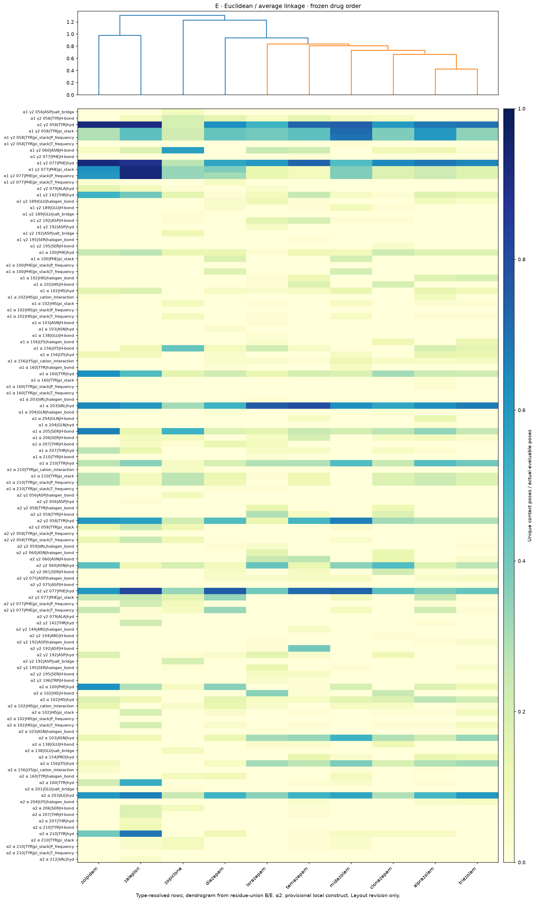
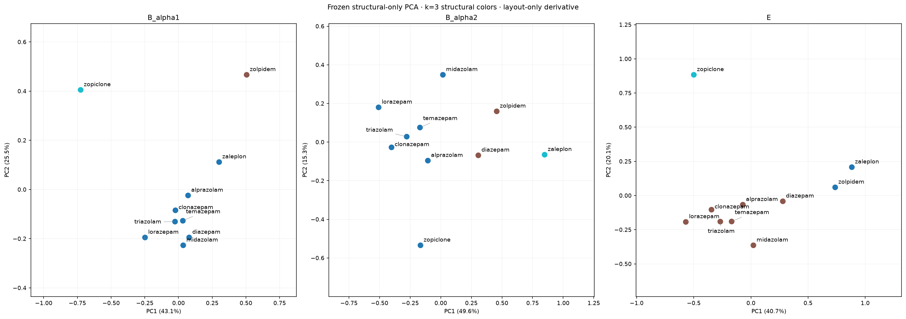
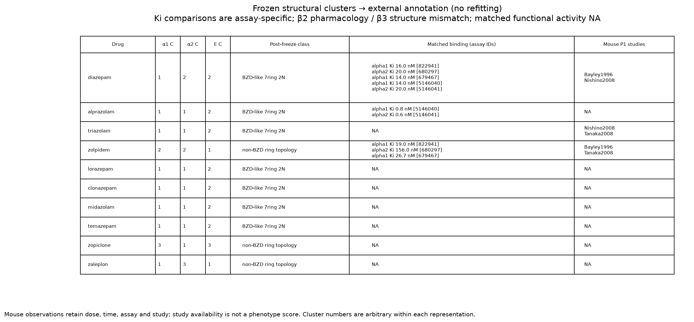

# 10-drug standardized redocking / unsupervised fingerprint PoC

10剤すべてを新しい共通環境で再Dockingした正式dataset。旧4剤の数値は継ぎ足さず、旧runはhistorical PoCとして保持した。主軸は **same receptor → different drugs**。薬理予測モデルは学習していない。

## Execution and environment
Python 3.12.13、RDKit 2025.09.6、AutoDock Vina 1.2.7、Meeko 0.7.1、PLIP 3.0.0。Open Babel conda packageは3.1.1、実ライブラリのOBReleaseVersionは3.1.0であり両方を記録。その他依存packageはsoftware_versions.jsonと完全lockに保存。Vinaは既存arm64 binaryの実SHA256を保存し、インストール元は未確認。
100/100 Docking成功、883 pose、883/883 PLIP成功。全drug/blockで5 seed、各seed最大9 pose。aggregate分母は実数[35, 45]（drug/blockごと）で、9未満のposeを補完しない。raw contacts 4568行。全XMLと元pose PDBQT・logをdrug別tar.gzへ可逆保存し、全member hashを照合。
Seeds: 2026091901–2026091905。exhaustiveness8、num_modes9、energy_range4、CPU1/job、min_rmsd1.0、Vina scoring。boxは旧記録のcenter/sizeを固定、各辺20 Å。各blockで同一prepared receptor hashを100job manifestから確認。
ChEMBL ID/SMILES/InChIKeyを既存取得runから利用。ETKDGv3 seed20260919、AddHs、MMFF94s最大2000反復（全剤収束）、Meeko Gasteiger PDBQT。TORSDOF/BRANCHは全剤一致（1–4）。RDKitとの差はOHやcarbamate、非等価置換tertiary amide等の定義差で、ligand_rotatable_bond_audit.csvに実結合を保存。旧TORSDOF0と異なり全剤を剛体にはしていない。
受容体は6HUP ABCDE、9CTJ CDE。Open BabelでHを一度付加しGasteiger/rigid PDBQTを固定。PLIPはNOHYDRO/NOFIXを固定し同じprepared Hを使用。PLIP実効config・versionを全poseで統一。原子型に関する全蛋白kekulization警告は隠さずprepare.logに保存。

## Dataset / analytical contract
A: residue any-contact binary。B: residue単位のtypeをcollapseしたunique-pose union frequency。C: residue×type＋P/T頻度。D: C＋contact条件付きcentroid distance/angle/offset。E: [α1 B | α2 B]。α1 21列、α2 27列、E48列。rawはtype頻度118列＋geometry30列、geometry欠損はNA。観測なし頻度0と混同しない。geometryはcontact-row平均でありpose平均と同じではない。
全観測interaction typeを保持（hydrophobic、π、H-bond、halogen、salt bridge、pi-cation等）。6指定残基を含む修正済みmappingを新prepared PDBへ照合し、未解決contactは0行。STRUCTURAL_SUMMARYの最初の集計で空表placeholderを1行と数えたmetadataを0に訂正したが、freeze対象の表/cluster/PCA/図は変更していない。
PrimaryはEuclidean＋average linkage、k=3、center-only PCA。PCAのzero-variance列除外とSVD符号規則を記録。cosineとbinary Jaccard、事前指定k2/4、C/D表現はsecondaryとして全結果保存。欠損列の採否は表ごと全10剤共通観測列で固定、pairwise比較可能feature数も保存。今回はprimary B/Eに欠損なし。distance matrixのEuclideanは距離で、小さいほど類似。

## A. Structural pattern
α1固定blockではzolpidem、zopicloneがそれぞれ別群、他8剤が同群。α2固定blockではdiazepam＋zolpidem、zaleplon単独、他7剤の群。これは各block内の薬剤比較であり、受容体間優劣ではない。Eでは7剤の群／zolpidem＋zaleplon／zopiclone単独に分かれた。k=3は事前指定で、自然な真のcluster数を証明したものではない。

| Representation | Features | PC1 | PC2 |
|---|---:|---:|---:|
| B_alpha1 | 21 | 43.10% | 25.54% |
| B_alpha2 | 27 | 49.58% | 15.31% |
| E | 48 | 40.72% | 20.10% |

PCA loadingの上位候補は機械的に各PC10件保存し、全loadingも保持。α1ではγ2 PHE77/TYR58/ASN60、α2ではcommon α TYR210、γ2 PHE77、common α PHE100/TYR160などの頻度が大きいloadingを持つ。これらは残基因果効果ではない。小さいdrug range ≤2/9のfeatureをmechanistic findingとして強調しない。

## B. Computational robustness
| Representation | Seed vs aggregate distance Spearman | k=3 ARI |
|---|---:|---:|
| B_alpha1 | 0.823–0.914 | 0.646–1.000 |
| B_alpha2 | 0.805–0.892 | 0.374–0.911 |
| E | 0.861–0.956 | 0.643–1.000 |

Eのk=3所属は5 seed中4でaggregateと一致、1 seedではdiazepamが変化。α2の所属はより変動する。range>0.40の事前閾値では、Cのdrug-feature 11/1180、Bのdrug-feature 7/480をunstableとした。小さい割合だけで全体の頑健性を断定しない。
Representation依存性もある。α1 B対CのARIは0.646、α2 B対Cは1.000。一方binaryやgeometry付きDはBと異なる分割になる（例：α1 AのARI −0.229、α1 D 0.338）。E cosine k3もEuclideanとARI0.643で一致しない。したがって全表現・metricに普遍的なclusterとは言えない。seedの一致は探索計算の感度であり、生物学的独立replicateや統計的信頼区間ではない。

## C. External correspondence
構造freeze日時: 2026-09-19T07:36:47.607701+09:00。外部annotation処理開始: 2026-09-19T09:13:50.927865+09:00。freezeの全hashをannotation後にも検証。
Matched pharmacologyはdiazepam/alprazolam/zolpidemの3剤、5 assay context・10 activityのみ。Kiをcontextごとに保持し、functional potency/efficacyのmatched値はNA。unpairedな既存活動は別logへ保存し、群代表値として転用しない。β2薬理とβ3構造はcontext_mismatch。追加6剤とtriazolamのmatched薬理は今回の既存filterではNAであり、文献全体にデータが存在しないという意味ではない。
対応を支持しない例もある。α1でdiazepam/alprazolamは同clusterでもKi14/0.8 nM。diazepam/zolpidemは別clusterでも同一assay Ki16/19 nM。α2でdiazepam/zolpidemは同clusterでもKi20/156 nM。近い構造なら薬理も近いという単純な関係は支持されず、3剤の少数pairから全体関連を検証できない。
既存P1 mouse evidenceはdiazepam/triazolam/zolpidemの3剤39行を保持。dose/time/route/endpoint/studyを固定して比較可能な8条件はdiazepam–triazolamの1薬剤対のみ。Nishino2008のrotarod同用量2/5 mg/kg・各15/30/60/90分では、同E clusterでもtriazolamのpositive countが7条件で高く1条件で同値。8条件を8独立薬剤対と数えない。他studyや未報告条件・qualitative記録は混合しない。mouse phenotype群との一般的対応は判断不能。
freeze後のChEMBL SMILES ring-topology annotationでは、Eの7剤群が7員環2NのBZD-like群に一致した。zolpidem/zaleplonは同群、zopicloneは別群。ただしα1/α2単独ではこの分類が完全再現されず、化学骨格とfingerprintの対応がactivity prediction能力を示すわけでもない。「強い作用」の共通endpointが確保されていないため、その群集も評価不能。

## D. ML rationale
**indeterminate**。構造的パターンと一定のseed安定性はあるが、representation/metric依存と外部データ不足・context不一致が残る。追加薬剤のデータ整備を進める実行可能性は示せたが、supervised MLで薬理を予測できる根拠はまだ判断不能。今回のnegative/inconclusiveな対応結果を隠してcluster条件を変更していない。
次は同一receptor composition/species/assay/endpointで外部yのdrug coverageを増やすことが先決。独立drug評価でdocking score/simple contactに対する追加表現の増分を検証する。十分なnの外部検証で増分が再現しなければ、fingerprintの予測情報価値仮説を支持しない。

## Major limitations
最大の制約は10剤に対する比較可能な外部薬理が3剤しかなく、しかもβ2/β3 contextが異なること。構造側にもα2 provisional local construct、単一受容体構造、単一初期conformer・固定ring、未指定立体3剤（lorazepam/temazepam/zopiclone）の単一sample、pH/microstate非列挙、Open Babel前処理の警告がある。複数poseは独立drugではない。受容体構造や立体/protonation変更に対するrobustnessは今回未評価。

## QC / files
136 tests PASS、既存776ファイルのSHA256不変、883 XML保存/hash一致、archive全member一致、準備file固定、0/NA区別、非平均、外部annotation後も構造freeze一致。
FINAL_REPORT/QC_REPORT、全CSV、完全environment lock、実効PLIP config、raw/archives、再現手順REPRODUCTION.mdを参照。PDF/PNGの読みやすい版はfigures/reviewed/。original frozen figuresはそのまま保持し、dendrogram/heatmap幅・PCA labelだけを修正したderivativeを追加（再計算・refitなし）。

