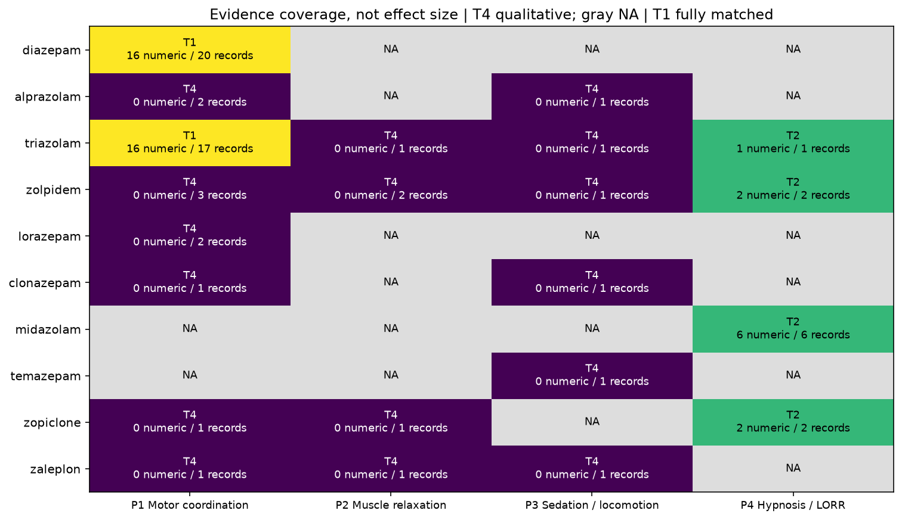
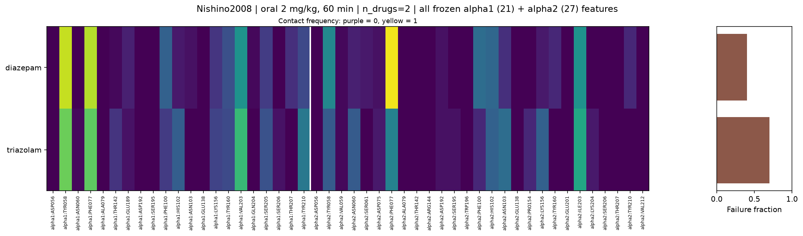
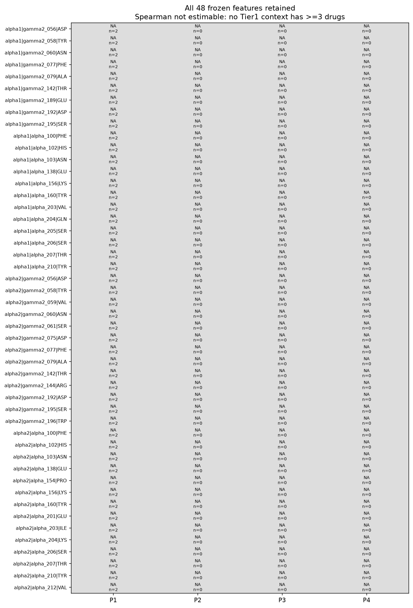

# Fixed fingerprint × phenotype decomposition PoC

既存10剤の構造fingerprintを変更せず、Y側をP1 motor coordination、P2 muscle relaxation、P3 sedation/locomotion、P4 hypnosisに分離した。各assayは複数の生理機能に影響されるproxyであり、4つの純粋な独立機序を測定したとは解釈しない。

## A. Phenotype feasibility
対象10剤中、定性を含む文献証拠は10剤、数値は5剤。raw evidence 69行。coverageは次表。

| Axis | Any evidence | Numeric | Tier1 drugs |
|---|---:|---:|---:|
|P1|8|2|2|
|P2|4|0|0|
|P3|6|0|0|
|P4|4|4|0|

Tier1はNishino2008のdiazepam/triazolam、同一用量2/5 mg/kg × 15/30/60/90分の8 contextのみ。薬剤数は2、unique drug pairは1。時間・用量をreplicate drugsにしない。Nishino表のstrain/sex/controlを原論文から補足。Tanaka2008は誤差表記をSEMとして新run内で訂正し、旧ファイルは不変。Table1のtriazolam0.3 mg/kgとmethods本文3 mg/kgの不一致も明示した。

TanakaのP4はthiopental併用のdurationで、単独薬hypnosisとは別。用量・saline/PPGが異なりTier1にしない。Midazolamは幼若雄C57BL/6のLORR countであり、他studyへ転用しない。Temazepamは反復投与後の耐性の定性記録で、急性効果量ではない。T4「効果なし」は0ではなく数値NA。phenotype_profileは各cellの全value/source/tier/contextをJSONで保持し、study横断の代表値を作らない。

正規化は失敗数/n。durationは秒のまま保持。controlとの差によるreductionの実装はあるが、対応するcontrolと実数値がない場合は計算しない。元表の全dose-responseを保持し、同一drug・study・time・assay内のobserved-range AUCとmaximumを記述。試験用量域が違うAUCを比較しない。最低有効用量はsignificanceを再構成せずNA。原論文ED50は出典付きで別欄に保持し、mg/kgから薬効順位を作らない。

## B. Structural correspondence
**indeterminate**。全48個の固定X featureに対してcontextごとのSpearman表を保存したが、Tier1はn_effective=2であり、rhoはNAとした。2点なら非tie時に必ず±1となるため、高相関候補として報告しない。P2/P3/P4にはTier1数値contextがなくn=0。featureの選別や削除はしていない。

P1ではtriazolamのfailure fractionがdiazepamより8条件中7条件で高く1条件で同値。これは同じ1対についての方向の記述に限る。rank表・全feature heatmap・事前指定TYR58のscatterを保存。特定残基やfeature combinationがphenotypeを説明するとの候補確定には足りない。「最も強く対応するaxis」は判断不能で、P1は最も比較可能な数値があるaxisにすぎない。

## C. Multi-receptor relevance
**indeterminate**。同じ1対の構造類似度は各block内で固定値なのにphenotype差はdose/timeで変わる。Figure5の8点は独立8drug-pairsではない。α1、α2、連結Eの3パネルを並べたが、どれがphenotypeをよりよく説明するかの比較統計は成立しない。連結の有用性を示したとは結論しない。

## D. ML rationale
**indeterminate**。4axisの情報整理は実行可能だが、比較可能なYを備えたdrug数が足りない。教師ありモデルは実行していない。次の反証可能な仮説は、同一assay/time/routeと測定された脳内曝露を揃えた独立薬剤群で、固定Eの薬剤間距離がP1/P2/P3/P4それぞれの差と関連し、single-blockや単純化学記述子を超える情報を持つか、である。再現しなければ追加情報仮説は支持されない。

## Limitations / source audit
最大の制約は定性coverageと比較可能な数値coverageの乖離：10剤に文献証拠があってもTier1は2剤のみ。PK、年齢、溶媒、併用薬、投与歴、species、endpointを跨いだ混合はしていない。検索は記録した公開情報の範囲でありsystematic reviewではない。全文未取得の論文では数値抽出を推測しない。Mouse以外・4axis外の候補は別表で保持。既存のP1/P2というevidence labelは今回のphenotype axisやcomparability tierとは無関係に再評価した。

構造側にはβ3構造、α2 provisional local construct、10剤のみ、単一conformer・固定環・未指定立体・pH microstate未列挙が残る。動物phenotypeからヒトふらつき・副作用を説明したとはいえない。

## Sources
- [Nishino2008](https://doi.org/10.1254/jphs.08107FP): Table1、methods、reported ED50。
- [Tanaka2008](https://doi.org/10.1254/jphs.FP0071991): Table1、Figure1とmethods/results。
- [Sanger1996](https://pubmed.ncbi.nlm.nih.gov/8905326/)、[Stanley2005](https://pubmed.ncbi.nlm.nih.gov/15888506/)、[Ono1976](https://pubmed.ncbi.nlm.nih.gov/986989/)、[Barnhill1990](https://pubmed.ncbi.nlm.nih.gov/2162948/)、[Marshall1997](https://pubmed.ncbi.nlm.nih.gov/9264062/): abstract-level qualitative evidence。
- [Shi2024](https://doi.org/10.1186/s40001-024-02142-6): Table1、juvenile methods。既存Bayley/Bourin/Henauer/Lopezも元行とsource IDを保持。

## Validation
140 tests passed; archived 925 files unchanged. All 32 Nishino count cells checked against rendered original Table1. Full 48-feature X retained. Source tables, search/access limits and duplicate/template exclusions are recorded.
